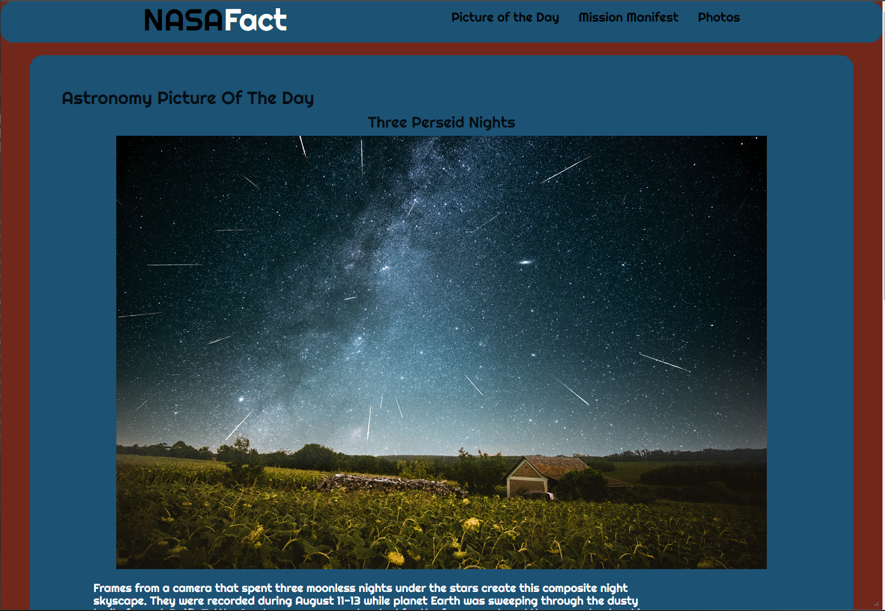

# NASA Dashboard

## Screenshot

## About
This application show's you images from space that you don't usually see. It shows a picture of the day of astronomy and images mars rover Curiosity. For the picture of the day it shows a diffent astonomy picture every day. To view images from the mars rover by choosing a camera and prees the button it will display the first image and the number of images for that camera. You can choose a differnt image by typing the number and clicking the button again.
## Built With
This web application was built using HTML, JavaScript, and CSS for styling with some bootstrap. Also used NASA API's APOD(Astronomy Picture of the Day.) and Mars Rover Photos API.
## Installation
If you like to try out the application locally and test it out. Copy the command below.
  Clone the repo
   ```sh
   git@github.com:missile11011/marsdashboard.git
   ```

Project Link: [https://missile11011.github.io/marsdashboard/](https://missile11011.github.io/marsdashboard/)